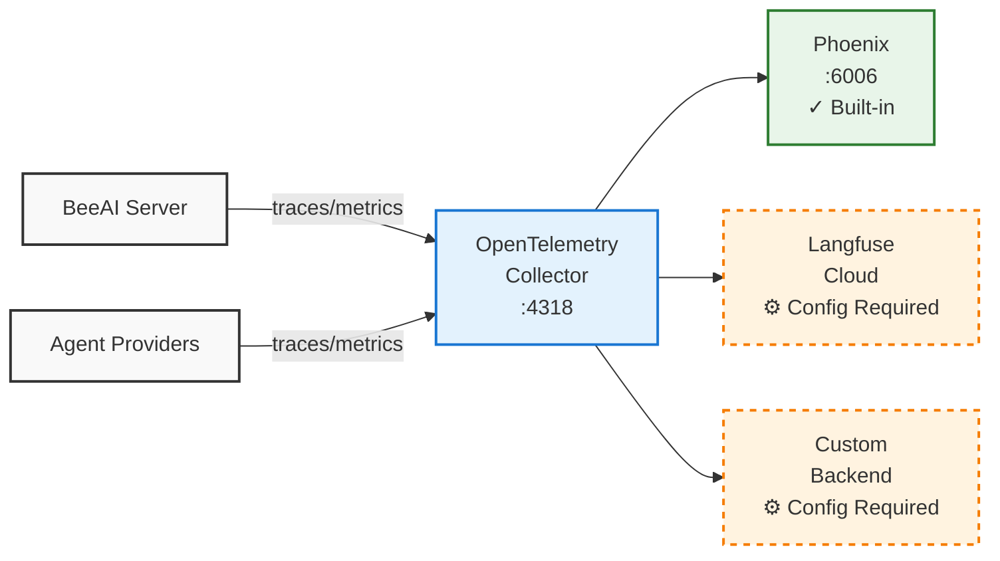

BeeAI Platform includes built-in observability through [OpenTelemetry (OTLP)](https://opentelemetry.io/), with [Arize Phoenix](https://docs.arize.com/phoenix) available out-of-the-box for immediate use. Monitor your agents through logging, telemetry, and integration with external monitoring systems.



## View Agent Logs

Stream real-time logs from any running agent:
```bash
beeai logs
```

What you'll see:
- Agent startup and initialization
- Request processing steps
- Error messages and stack traces
- Container lifecycle events

<Note>
  Logs are only available for managed (containerized) agents that are currently running.
</Note>

## Telemetry Collection

BeeAI includes OpenTelemetry instrumentation to collect traces and metrics. Telemetry data helps with performance monitoring, error tracking, usage analytics, and debugging agent interactions.

By default, BeeAI sends telemetry to:
- **Local Phoenix instance** (if running) for trace visualization

The telemetry includes:
- Platform version and runtime details
- Agent execution traces

## Quickstart: Enable Phoenix Observability

[Arize Phoenix](https://phoenix.arize.com/) provides visualization for OpenTelemetry traces from your agents.

<Warning>
  **Important License Notice**: Phoenix is disabled by default in BeeAI. When you enable Phoenix, be aware that Arize Phoenix is licensed under the Elastic License v2 (ELv2), which has specific terms regarding commercial use and distribution. By enabling Phoenix, you acknowledge that you are responsible for ensuring compliance with the ELv2 license terms for your specific use case. Please review the [Phoenix license](https://github.com/Arize-ai/phoenix/blob/main/LICENSE) before enabling this feature in production environments.
</Warning>

<Steps>
   <Step title="Install and Enable Arize Phoenix">

Install and start Phoenix using the `beeai platform start` command:
```sh
beeai platform start --set phoenix.enabled=true
```

You can run this even if your platform is already running without losing data.

   </Step>
   <Step title="Check if Phoenix is running">

Spinning up Phoenix can take a while, even after the `platform start` command reports success. Go to [http://localhost:6006](http://localhost:6006) and check if it's running. If not, please wait a few minutes or check your internet connection.

   </Step>
   <Step title="Run Agent with Phoenix">

Execute the following command to run an example chat agent:
```sh
beeai run chat "Hello"
```

   </Step>
   <Step title="View Traces in Phoenix">

Open [http://localhost:6006](http://localhost:6006) in your browser and navigate to the **default** project to explore the collected traces.

   </Step>
</Steps>

<Tip>
  For an enhanced user experience and richer trace detail, consider instrumenting agents using the [OpenInference](https://github.com/Arize-ai/openinference/) standard for custom instrumentation.
</Tip>

## Advanced Configuration

### Configure Langfuse Integration

[Langfuse](https://langfuse.com/) is an LLM observability platform that can be integrated with the BeeAI Platform through OpenTelemetry.

<Steps>
<Step title="Get Langfuse credentials">
1. Sign up at [cloud.langfuse.com](https://cloud.langfuse.com)
2. Create a project and generate API keys
3. Encode your keys: `echo -n "public_key:secret_key" | base64`
</Step>
<Step title="Create a configuration file (config.yaml):">
```yaml
collector:
  exporters:
    otlphttp/langfuse:
      endpoint: "https://cloud.langfuse.com/api/public/otel" # EU data region
      headers:
        Authorization: "Basic <auth-string>"
  pipelines:
    traces:
      receivers: [ otlp ]
      processors: [ memory_limiter, filter/phoenix, batch ]
      exporters: [ otlphttp/langfuse ]
```
</Step>
<Step title="Start the platform with the configuration">
```bash
beeai platform start -f config.yaml
```
</Step>
<Step title="Access Langfuse UI">
Check your Langfuse project dashboard for incoming traces and metrics.
</Step>
</Steps>

## Additional Resources

- **OpenTelemetry Docs**: https://opentelemetry.io/docs/
- **Langfuse Docs**: https://langfuse.com/docs
- **Phoenix Docs**: https://docs.arize.com/phoenix
- **Prometheus Docs**: https://prometheus.io/docs/
- **Grafana Docs**: https://grafana.com/docs/
