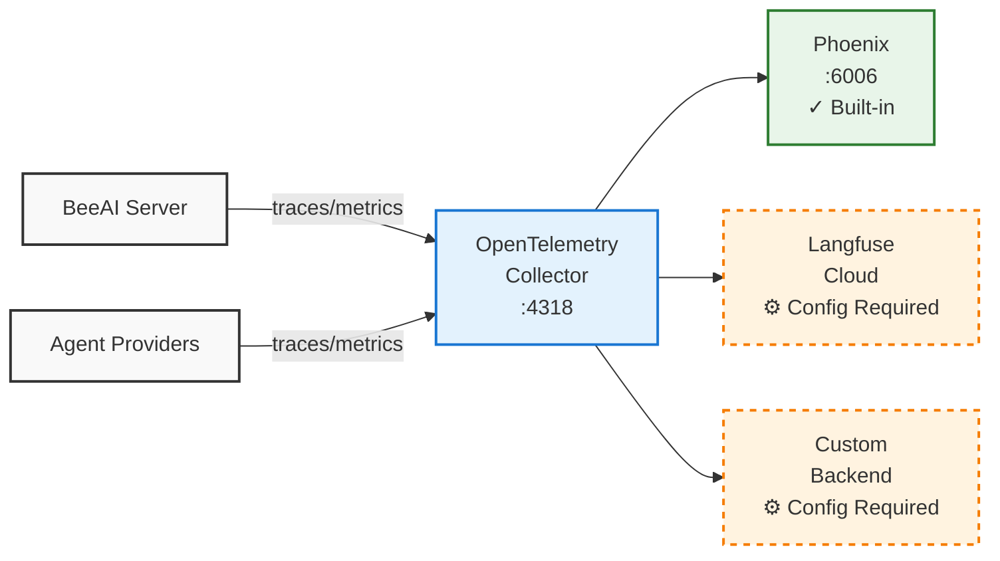

BeeAI Platform includes built-in observability through [OpenTelemetry (OTLP)](https://opentelemetry.io/), with [Arize Phoenix](https://docs.arize.com/phoenix) available out-of-the-box for immediate use. Additional backends like Langfuse can be configured for advanced analytics.



## Quickstart

### Enable Phoenix Observability

<Steps>
<Step title="Start platform with Phoenix enabled">
```bash
beeai platform start --set phoenix.enabled=true
```
</Step>
<Step title="Access Phoenix UI">

Navigate to http://localhost:6006 in your browser to view traces, spans, and LLM interactions.

</Step>
</Steps>

## Advanced

### Configure Langfuse Integration

[Langfuse](https://langfuse.com/) is an LLM observability platform that can be integrated with the BeeAI Platform through OpenTelemetry.

<Steps>
<Step title="Get Langfuse credentials">
1. Sign up at [cloud.langfuse.com](https://cloud.langfuse.com)
2. Create a project and generate API keys
3. Encode your keys: `echo -n "public_key:secret_key" | base64`
</Step>
<Step title="Create a configuration file (config.yaml):">
```yaml
collector:
  exporters:
    otlphttp/langfuse:
      endpoint: "https://cloud.langfuse.com/api/public/otel" # EU data region
      headers:
        Authorization: "Basic <auth-string>"
  pipelines:
    traces:
      receivers: [ otlp ]
      processors: [ memory_limiter, filter/phoenix, batch ]
      exporters: [ otlphttp/langfuse ]
```
</Step>
<Step title="Start the platform with the configuration">
```bash
beeai platform start -f config.yaml
```
</Step>
<Step title="Access Langfuse UI">
Check your Langfuse project dashboard for incoming traces and metrics.
</Step>
</Steps>

## Additional Resources

- **OpenTelemetry Docs**: https://opentelemetry.io/docs/
- **Langfuse Docs**: https://langfuse.com/docs
- **Phoenix Docs**: https://docs.arize.com/phoenix
- **Prometheus Docs**: https://prometheus.io/docs/
- **Grafana Docs**: https://grafana.com/docs/
