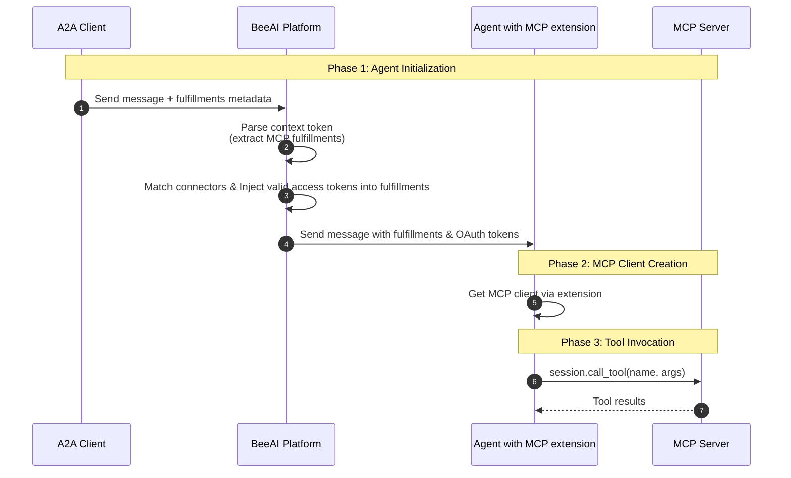

# Connector Injection

Related PR: https://github.com/i-am-bee/beeai-platform/pull/1357

This document describes how BeeAI Platform injects OAuth tokens from connectors into agent MCP clients at runtime, enabling secure access to protected MCP servers.

## Overview

Connector Injection is the mechanism that allows agents to use connectors without handling OAuth tokens directly. The platform:
- **Agents declare MCP needs** via A2A extension
- **A2A Client calls agents** with an MCP server
- **Platform resolves connectors** and injects OAuth tokens
- **Platform manages token lifecycle** transparently (refresh, storage, revocation)

## Limitations & Future Architecture

> **⚠️ Current Limitation:** This token injection approach does not work well with long-running agents. OAuth access tokens have limited lifespans (typically 1 hour), and once an agent is initialized with a token, there is no mechanism to refresh it during execution. If an agent runs longer than the token's validity period, MCP tool calls will fail with authorization errors.

> **🔮 Future Direction:** This architecture will be replaced with an **MCP Proxy** approach where the platform acts as a proxy between agents and MCP servers. The proxy will handle token refresh transparently, allowing agents to run indefinitely without token expiration concerns. This also improves security by not injecting tokens into agent runtime environments.
>
> **Note for Agent Builders:** This architectural change will be transparent to agent developers. Agents will continue to use the same MCP extension API to invoke MCP tools - the underlying token management mechanism will change from A2A proxy injection to MCP proxy injection without requiring any changes to agent code.

## Runtime Flow

