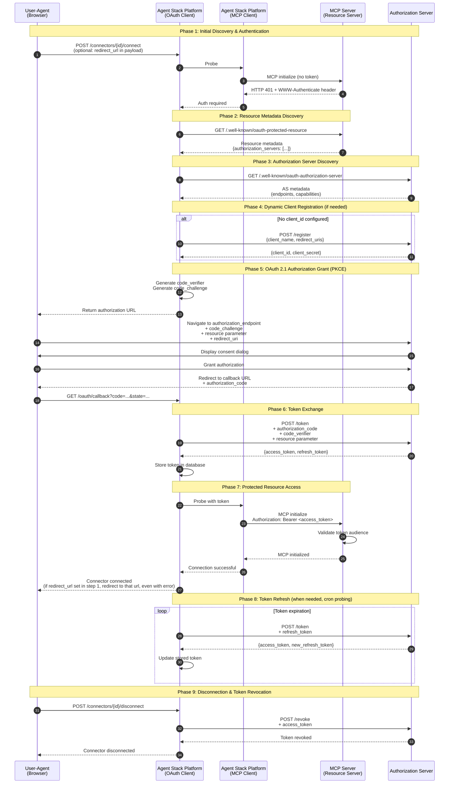
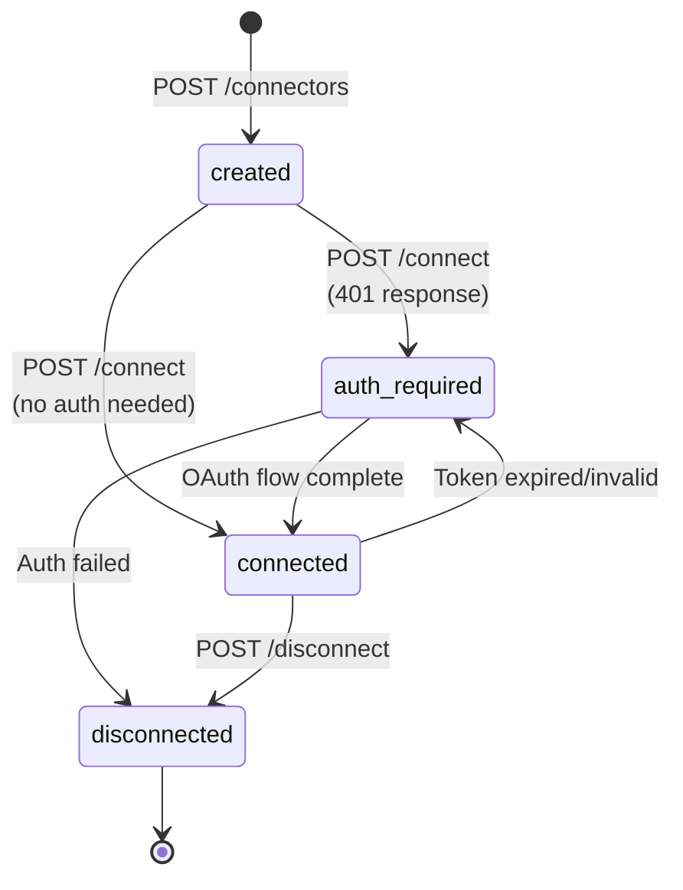

# Connectors API

This document describes the Connectors API for managing connections to remote MCP servers in Agent Stack.

## Table of Contents

- [Overview](#overview)
- [OAuth Authorization Flow](#oauth-authorization-flow)
- [API Endpoints](#api-endpoints)
- [Connector States](#connector-states)
- [Error handling](#error-handling)
  - [Authorization Code Flow](#authorization-code-flow)
  - [Disconnection](#disconnection)
- [Connector Presets](#connector-presets)
  - [Available Presets](#available-presets)
  - [Using Presets](#using-presets)
  - [Configuring Presets](#configuring-presets)

## Overview

The Connectors API enables Agent Stack to securely connect to protected MCP servers using OAuth 2.1 authorization. The architecture designates:
- **Agent Stack** as the OAuth client
- **MCP servers** as resource servers
- **Authorization servers** for token issuance

## OAuth Authorization Flow



## API Endpoints

| Endpoint | Purpose |
|----------|---------|
| `GET /connectors/presets` | List available connector presets |
| `POST /connectors` | Create new connector configuration |
| `GET /connectors` | List all connectors |
| `GET /connectors/{id}` | Get connector details |
| `POST /connectors/{id}/connect` | Initiate connection & OAuth flow |
| `GET /oauth/callback` | Handle OAuth authorization callback |
| `POST /connectors/{id}/disconnect` | Revoke tokens and disconnect |
| `DELETE /connectors/{id}` | Delete connector configuration |

## Connector States



## Error handling

The connectors API endpoints return standard HTTP status codes in responses. Apart from that, there are two additional mechanisms used by connectors API to relay errors to the client.

### Authorization Code Flow

An error may happen during the authorization code flow as described in [RFC6749 Section 4.1](https://www.rfc-editor.org/rfc/rfc6749#section-4.1.2.1).

When no `redirect_url` has been provided by the client during connection initiation, the server responds with a HTML page containing the error. Otherwise, the user will be redirected to `redirect_url` instead. The `error` and `error_description` query parameters will be included in the redirect.

### Disconnection

Connector can be asynchronously disconnected at any time. This happen be for various reason including intentional disconnect, refresh token expiration or an arbitrary error. The client MAY check for the `disconnected` state and read `disconnect_reason` to read the description of what happened.

## Connector Presets

Connector presets provide pre-configured settings for common MCP servers, simplifying the connector creation process. Presets can include:
- **URL**: The MCP server endpoint
- **Client credentials**: Pre-configured OAuth `client_id` and `client_secret` for public clients
- **Metadata**: Display information such as name and description

### Available Presets

The platform comes with several built-in presets:

| MCP Server | URL | Description |
|------------|-----|-------------|
| Stripe | `https://mcp.stripe.com` | Payment processing and financial infrastructure tools |
| Box | `https://mcp.box.com` | Search, access and get insights on your Box content |
| GitHub | `https://api.githubcopilot.com/mcp` | Access and interact with your GitHub repositories and code intelligence |

### Using Presets

When creating a connector with `POST /connectors`, the system automatically matches the provided URL against available presets (this behavior is controlled by the `match_preset` parameter, which defaults to `true`). If a match is found:

1. **Client credentials**: If no `client_id` is provided in the request, the preset's credentials are used automatically
2. **Metadata**: If no metadata is provided in the request, the preset's metadata (name, description) is used

This allows for simplified connector creation. For example, to create a GitHub connector:

```json
POST /connectors
{
  "url": "https://api.githubcopilot.com/mcp"
}
```

The system will automatically apply the preset's client credentials and metadata.

To disable preset matching and provide all credentials manually, set `match_preset: false` in the request.

### Configuring Presets

Connector presets are configurable via Helm values when deploying Agent Stack. The presets are defined in the `connector.presets` section of `values.yaml`:

```yaml
connector:
  presets:
    - url: "https://mcp.stripe.com"
      metadata:
        name: "Stripe"
        description: "Payment processing and financial infrastructure tools"
    - url: "https://mcp.box.com"
      client_id: "YOUR_CLIENT_ID"
      client_secret: "YOUR_CLIENT_SECRET"
      metadata:
        name: "Box"
        description: "Search, access and get insights on your Box content"
```

The presets are injected into the platform via the `CONNECTOR__PRESETS` environment variable, which is populated from a Kubernetes Secret created by Helm. This allows administrators to:

- Add custom MCP server presets for their organization
- Modify or remove default presets
- Configure client credentials for private MCP servers
- Customize metadata (names, descriptions) for better user experience

After modifying preset configuration in Helm values, redeploy the platform for changes to take effect.
