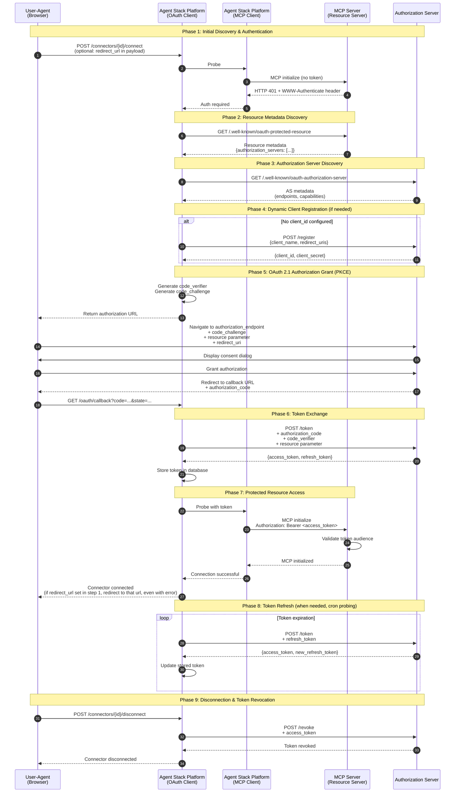
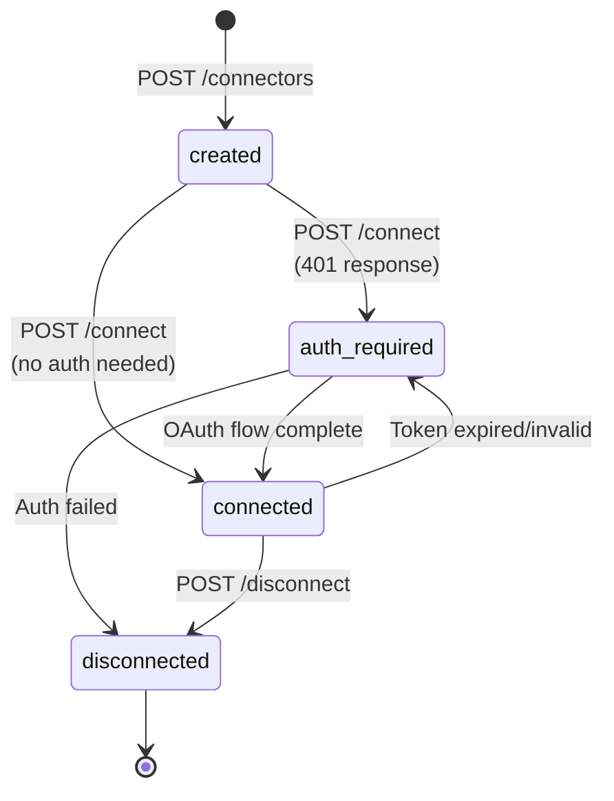

# Connectors API

Related PR: https://github.com/i-am-bee/agentstack/pull/1357

This document describes the Connectors API for managing connections to remote MCP servers in Agent Stack.

## Overview

The Connectors API enables Agent Stack to securely connect to protected MCP servers using OAuth 2.1 authorization. The architecture designates:
- **Agent Stack** as the OAuth client
- **MCP servers** as resource servers
- **Authorization servers** for token issuance

## OAuth Authorization Flow

## API Endpoints

| Endpoint | Purpose |
|----------|---------|
| `POST /connectors` | Create new connector configuration |
| `GET /connectors` | List all connectors |
| `GET /connectors/{id}` | Get connector details |
| `POST /connectors/{id}/connect` | Initiate connection & OAuth flow |
| `GET /oauth/callback` | Handle OAuth authorization callback |
| `POST /connectors/{id}/disconnect` | Revoke tokens and disconnect |
| `DELETE /connectors/{id}` | Delete connector configuration |

## Connector States

