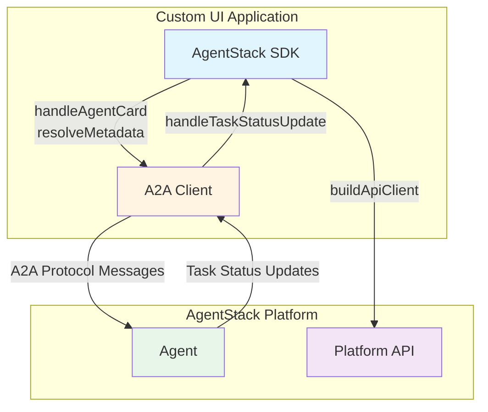

The Agent Stack TypeScript Client SDK simplifies building custom UIs for A2A agents. It handles agent service demands, maps task status updates to UI actions, and provides a typed platform API client. Use it to fulfill agent requirements, render interactive elements like forms and approvals, and manage communication between your UI and Agent Stack.

It builds on the [Agent2Agent Protocol (A2A)](https://a2a-protocol.org/) and provides two layers:

1. A2A extensions and helpers that map agent demands to client fulfillments and UI metadata.
2. A platform API client that talks to the AgentStack server.

The SDK also exports A2A protocol types and Zod schemas so your UI can stay in sync with the protocol.

## What the SDK Exports

The public surface of the SDK is grouped into four entrypoints:

1. `agentstack-sdk` for everything
2. `agentstack-sdk/api` for platform API client, schemas, and types
3. `agentstack-sdk/core` for extension helpers and A2A interaction utilities
4. `agentstack-sdk/extensions` for A2A extension definitions and types



## Core Workflows

### 1. Handle agent card demands

Agents declare service demands in their agent card. Use `handleAgentCard` to read these demands and produce metadata fulfillments.

```typescript
import { handleAgentCard } from "agentstack-sdk";

const { demands, resolveMetadata } = handleAgentCard(agentCard);

const metadata = await resolveMetadata({
  llm: async (llmDemands) => {
    return {
      llm_fulfillments: {
        default: {
          identifier: "llm_proxy",
          api_base: "{platform_url}/api/v1/openai/",
          api_key: contextToken.token,
          api_model: "gpt-4o",
        },
      },
    };
  },
});
```

Use `buildMessageBuilder(agentCard)` when you want a helper that turns a user message into a fully formed A2A message with metadata.

### 2. Stream task status updates into UI actions

When you stream A2A task events, `handleTaskStatusUpdate` maps status updates into actionable UI events.
It focuses on `auth-required` and `input-required` states, which cover OAuth, secrets, forms, and approvals.

```typescript
import { handleTaskStatusUpdate, TaskStatusUpdateType } from "agentstack-sdk";

for await (const event of stream) {
  if (event.kind === "status-update") {
    for (const update of handleTaskStatusUpdate(event)) {
      if (update.type === TaskStatusUpdateType.FormRequired) {
        // Render update.form
      }
    }
  }
}
```

### 3. Build user metadata

When the user responds to forms, approvals, or canvas requests, use `resolveUserMetadata` to build message metadata.

```typescript
import { resolveUserMetadata } from "agentstack-sdk";

const metadata = await resolveUserMetadata({
  form: { name: "Ada" },
  approvalResponse: { decision: "approve" },
});
```

### 4. Use the platform API client

`buildApiClient` exposes the platform API with typed responses and runtime validation.

```typescript
import { buildApiClient, createAuthenticatedFetch } from "agentstack-sdk";

const api = buildApiClient({
  baseUrl: "https://your-agentstack-instance.com",
  fetch: createAuthenticatedFetch("token-value"),
});
```

All API calls return `ApiResult<T>`. Use `unwrapResult` if you want exceptions, and then handle errors with `isHttpError`, `isNetworkError`, `isParseError`, and `isValidationError`.

## Extension Helpers at a Glance

These helpers are factories. You pass an extension definition once and get back a function tailored to that extension.

- `extractServiceExtensionDemands(extension)` returns a function that pulls typed demands for that service from an agent card.
- `fulfillServiceExtensionDemand(extension)` returns a function that applies a fulfillment into outgoing metadata for that service.
- `extractUiExtensionData(extension)` returns a function that reads typed UI metadata for that extension from messages.
- `buildLLMExtensionFulfillmentResolver(api, token)` returns a resolver that maps LLM demands to platform models.

## Protocol Types and Schemas

The SDK exports A2A protocol types and Zod schemas that match the AgentStack UI usage, including:

- `Message`, `Part`, and `Task` types
- `TaskStatusUpdateEvent` and `TaskArtifactUpdateEvent`
- UI and service extension schemas

These exports are useful when building strongly typed UI layers or validating inbound messages.

## Next Steps

- **[Agent Requirements](./agent-requirements)** for service and UI extension handling
- **[Platform API Client](./platform-api-client)** for endpoint reference and error helpers
- **[Error Handling](./error-handling)** for platform and extension error patterns
- **[User Messages](./user-messages)** for composing user messages with metadata
- **[A2A Client Integration](./a2a-client)** for end to end streaming with `@a2a-js/sdk`
