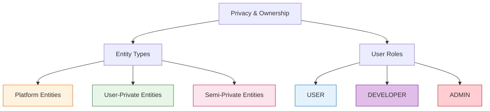
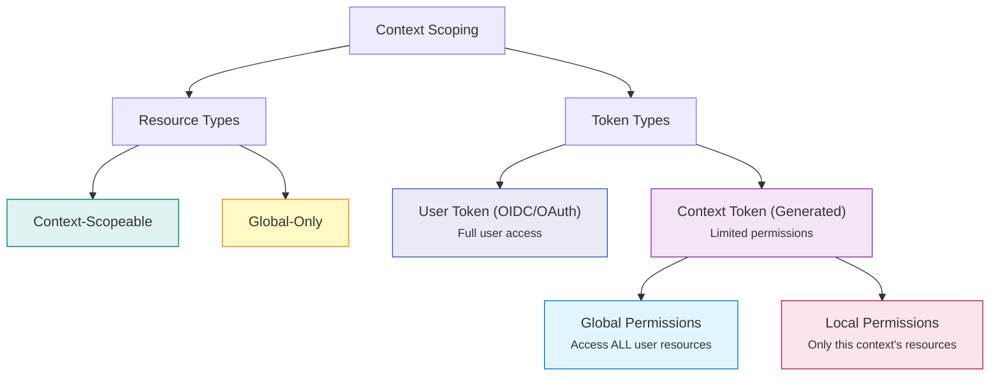
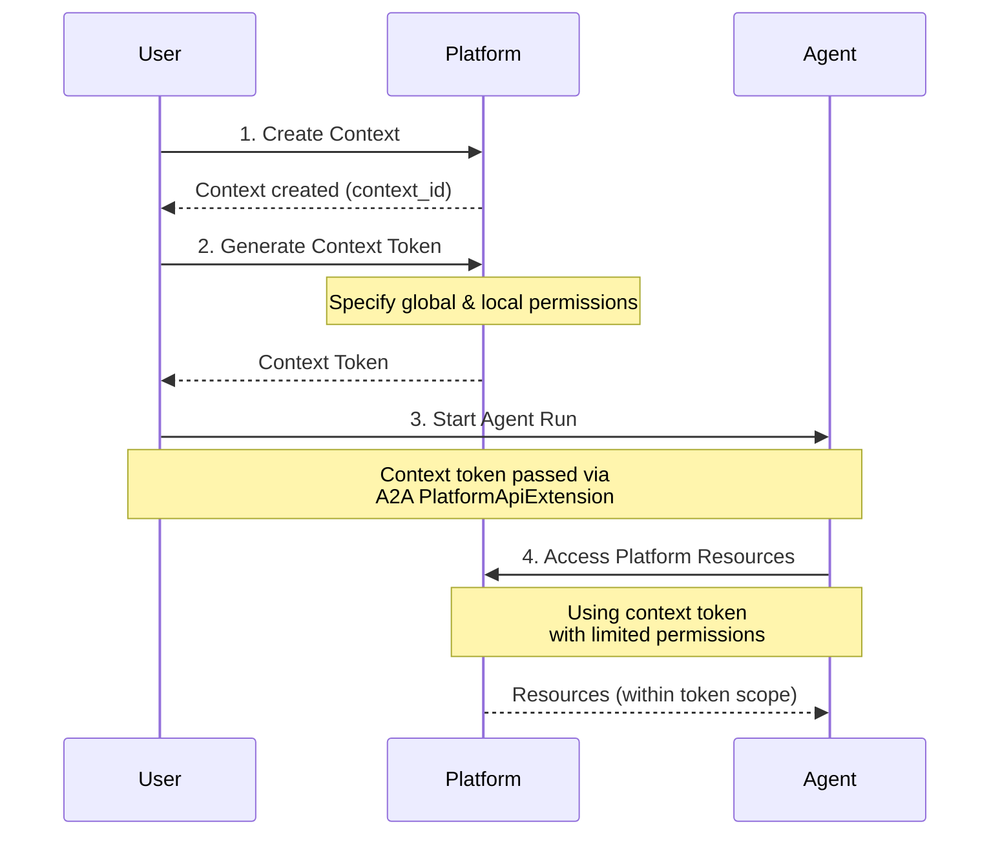

Agent Stack uses two types of authentication tokens to control access to platform resources:

1. **User Tokens** - Issued by your identity provider (OIDC/OAuth) for human users accessing the platform
2. **Context Tokens** - Generated programmatically for agents to access resources with limited permissions during a conversation

Both token types can be used to authenticate API requests, but serve different purposes and have different permission scopes.

## Understanding the Permission System

Agent Stack's permission system has two independent dimensions that work together:

1. **Privacy and Ownership** - Controls who can access resources (user roles and entity visibility)
2. **Context Scoping** - Controls where resources are associated and how agents access them

### Privacy and Ownership

This determines **who can access and manage resources** based on entity type and user role.




#### Entity Types

**Platform Entities** - Shared across all users in the platform:

| Entity                   | Description                             |
|--------------------------|-----------------------------------------|
| **system_configuration** | Platform-wide configuration             |
| **model_providers**      | Available LLM/embedding model providers |

**User-Private Entities** - Scoped to individual users (users can access their own):

| Entity            | Description                     |
|-------------------|---------------------------------|
| **files**         | Uploaded files and documents    |
| **vector_stores** | Vector databases for embeddings |
| **variables**     | User-specific variables         |
| **contexts**      | Conversation contexts           |
| **context_data**  | Context history and data        |
| **feedback**      | User feedback submissions       |

**Semi-Private Entities** - Visible to all users, but management is restricted by role:

| Entity                 | Description           |
|------------------------|-----------------------|
| **providers**          | Agent providers       |
| **provider_builds**    | Agent provider builds |

#### User Roles and Access

Agent Stack uses three role-based access levels:

**USER** - Standard user role:
- **Platform Entities**: Read-only access
- **User-Private Entities**: Full read/write access to their own resources
- **Semi-Private Entities**: Read-only access (can view all providers/builds but cannot manage them).

**DEVELOPER** - Extends USER with additional management capabilities:
- All USER permissions
- **Semi-Private Entities**: Can create and manage their own providers and provider builds

**ADMIN** - Full system access:
- Full access to all resources across the platform

### Context Scoping and Agent Access

This dimension controls **where resources are associated** and **how agents access them** through context tokens.

A **context** represents a single conversation with an agent. Resources can be associated with either:
- **User level** (not tied to any specific conversation)
- **Context level** (linked to a specific conversation)

This association, combined with token permissions, determines what an agent can access.

#### Context-Scopeable Resources

These resources can be **associated with** either the user level or a specific context:

- **files**: Can be user-level (not associated with any context) or context-associated (linked to a specific context)
- **vector_stores**: Can be user-level or context-associated
- **context_data**: Conversation history (always associated with a context)

<Warning>
    **Context association does NOT restrict access**

    Association with a context is just metadata. A user token or a context token with **global permissions** can access
    ALL user files, including files associated with other contexts. Only a context token with **local-only permissions**
    is restricted to files associated with that specific context.
</Warning>

#### Context Permissions for Agents

When agents interact with resources, they use **context tokens** with limited permissions. You can grant specific permissions for each resource type:





#### Available Permissions

| Resource            | Available Operations            | Context Scopeable | Description                     |
|---------------------|---------------------------------|-------------------|---------------------------------|
| **files**           | `read`, `write`, `extract`, `*` | ✔︎                | User files and documents        |
| **vector_stores**   | `read`, `write`, `*`            | ✔︎                | Vector databases for embeddings |
| **context_data**    | `read`, `write`, `*`            | ✔︎                | Conversation history            |
| **llm**             | `*`                             |                   | LLM inference services          |
| **embeddings**      | `*`                             |                   | Embedding generation services   |
| **a2a_proxy**       | `*`                             |                   | Agent-to-agent communication    |
| **model_providers** | `read`, `write`, `*`            |                   | Model provider management       |
| **variables**       | `read`, `write`, `*`            |                   | User variables                  |
| **providers**       | `read`, `write`, `*`            |                   | Agent providers                 |
| **contexts**        | `read`, `write`, `*`            |                   | Context management              |
| **connectors**      | `read`, `write`, `proxy`, `*`   |                   | External service connectors     |
| **feedback**        | `write`                         |                   | User feedback submissions       |

### Global vs. Local Permission Grants

When generating a context token, you specify **two independent permission sets** that control what the token can access:

#### Global Permissions
Grants the token access to **ALL user resources**, regardless of which context they're associated with.

**What the token can access:**
- All user-level files and vector stores (not associated with any context)
- Files and vector stores associated with ANY context (including other contexts)

**Example use cases:**
- Agent needs to search across all user files from previous conversations
- Agent needs to access a shared knowledge base (user-level vector store)
- Agent creates persistent resources that should be accessible to other contexts

#### Context Permissions (Local)
Grants the token access **ONLY to resources associated with this specific context**.

**What the token can access:**
- Files and vector stores associated with this specific context
- Context data (conversation history) for this context
- A restricted surface area - only resources linked to this conversation

**Example use cases:**
- Sandboxed agent that should only see files uploaded in this conversation
- Limiting agent access to prevent data leakage across conversations
- Working with conversation-specific temporary data

## Creating Context Tokens

Context tokens allow agents to authenticate with limited permissions. Here's the flow:



### Generating a Context Token

Here is an example how you can create a context and generate a custom token with specific permissions:

<CodeGroup>
    ```python Python SDK expandable
    from agentstack_sdk.platform.context import Context, Permissions, ContextPermissions

    # Create a context
    providers = await Provider.list()
    context = await Context.create()

    # Generate a token with specific permissions
    token = await context.generate_token(
        providers=[providers[0]],
        grant_global_permissions=Permissions(
            files={"read", "write"},
            llm={"*"},
            embeddings={"*"},
        ),
        grant_context_permissions=ContextPermissions(
            files={"read", "write"},
            context_data={"read", "write"},
        ),
    )

    # Use the token
    print(f"Token: {token.token.get_secret_value()}")
    print(f"Expires at: {token.expires_at}")

    ```

    ```bash REST API
    # 1. Create a context
    curl -X POST "https://api.agentstack.example.com/api/v1/contexts" \
        -H "Authorization: Bearer YOUR_USER_TOKEN" \
        -H "Content-Type: application/json"

    # Response
    {
        "id": "123abc",
        "created_at": "2025-01-15T10:00:00Z"
    }

    # 2. Generate a context token
    curl -X POST "https://api.agentstack.example.com/api/v1/contexts/{context_id}/token" \
        -H "Authorization: Bearer YOUR_USER_TOKEN" \
        -H "Content-Type: application/json" \
        -d '{
            "grant_global_permissions": {
                "files": ["read", "write"],
                "llm": ["*"],
                "embeddings": ["*"],
                "a2a_proxy": ["<provider_id>"]
            },
            "grant_context_permissions": {
                "files": ["read", "write"],
                "context_data": ["read", "write"]
            }
        }'

    # Response
    {
        "token": "eyJhbGciOiJIUzI1NiIsInR5cCI6IkpXVCJ9...",
        "expires_at": "2025-01-15T12:00:00Z"
    }
    ```
</CodeGroup>

<Note>
    **Important Notes**

    - Context tokens **cannot** be used to generate other tokens
    - The permissions you grant must be a subset of your own permissions
    - Context token expiration is 20 minutes. If an agent runs longer it must request a new token using `AuthRequired` a2a message.
</Note>

### Using Context Tokens in Agent Runs

When calling an agent using the Agent Stack SDK, you pass the context token through extension configurations. Here's a complete example:

```python Full Agent Run Client Example expandable
from datetime import timedelta

import httpx
from a2a.client import ClientConfig, ClientFactory
from a2a.types import Message, Part, Role, TextPart

from agentstack_sdk.platform import ModelProvider, Provider, ModelCapability
from agentstack_sdk.platform.context import Permissions, ContextPermissions, Context
from agentstack_sdk.a2a.extensions import (
    LLMServiceExtensionClient,
    LLMServiceExtensionSpec,
    EmbeddingServiceExtensionClient,
    EmbeddingServiceExtensionSpec,
    PlatformApiExtensionClient,
    PlatformApiExtensionSpec,
    LLMFulfillment,
    EmbeddingFulfillment,
)
from uuid import uuid4


async def call_agent(
    provider: Provider,  # any agent from Provider.list() call
    user_access_token: str,  # Access token obtained from OIDC provider (e.g. using authorization code OAuth flow)
):
    # 1. Create context and generate token
    context = await Context.create(provider_id="your_provider_id")

    context_token = await context.generate_token(
        grant_global_permissions=Permissions(
            llm={"*"}, embeddings={"*"}, a2a_proxy={"*"}
        ),
        grant_context_permissions=ContextPermissions(
            files={"*"}, vector_stores={"*"}, context_data={"*"}
        ),
    )

    # 2. Get agent card and prepare extension specs
    agent_card = provider.agent_card
    llm_spec = LLMServiceExtensionSpec.from_agent_card(agent_card)
    embedding_spec = EmbeddingServiceExtensionSpec.from_agent_card(agent_card)
    platform_spec = PlatformApiExtensionSpec.from_agent_card(agent_card)

    # 3. Build extension metadata with context token
    metadata = {}

    # LLM extension - token passed as api_key
    if llm_spec:
        metadata |= LLMServiceExtensionClient(llm_spec).fulfillment_metadata(
            llm_fulfillments={
                key: LLMFulfillment(
                    api_base="{platform_url}/api/v1/openai/",
                    api_key=context_token.token.get_secret_value(),
                    api_model=(
                        await ModelProvider.match(
                            suggested_models=demand.suggested,
                            capability=ModelCapability.LLM,
                        )
                    )[0].model_id,
                )
                for key, demand in llm_spec.params.llm_demands.items()
            }
        )

    # Embedding extension - token passed as api_key
    if embedding_spec:
        metadata |= EmbeddingServiceExtensionClient(
            embedding_spec
        ).fulfillment_metadata(
            embedding_fulfillments={
                key: EmbeddingFulfillment(
                    api_base="{platform_url}/api/v1/openai/",
                    api_key=context_token.token.get_secret_value(),
                    api_model=(
                        await ModelProvider.match(
                            suggested_models=demand.suggested,
                            capability=ModelCapability.EMBEDDING,
                        )
                    )[0].model_id,
                )
                for key, demand in embedding_spec.params.embedding_demands.items()
            }
        )

    # Platform API extension - token passed as auth_token
    if platform_spec:
        metadata |= PlatformApiExtensionClient(platform_spec).api_auth_metadata(
            auth_token=context_token.token, expires_at=context_token.expires_at
        )

    # 4. Create message and run agent
    message = Message(
        message_id=str(uuid4()),
        parts=[Part(root=TextPart(text="Hello, agent!"))],
        role=Role.user,
        context_id=context.id,  # Use the Context ID we just created
        metadata=metadata,
    )

    # 5. Execute agent run
    async with httpx.AsyncClient(
        # Add user token from OIDC provider
        headers={"Authorization": f"Bearer {user_access_token}"},
        follow_redirects=True,
        timeout=timedelta(hours=1).total_seconds(),
    ) as httpx_client:
        conf = ClientConfig(httpx_client=httpx_client, use_client_preference=True)
        a2a_client = ClientFactory(conf).create(card=agent_card)
        async for event in a2a_client.send_message(message):
            # Handle agent responses
            print(event)
```

### Inside Your Agent

When you declare the `PlatformApiExtensionServer` in your agent function, the Agent Stack SDK automatically authenticates your platform API calls using the context token that was passed through the extension metadata.

```python expandable
from typing import Annotated

from a2a.types import Message

from agentstack_sdk.a2a.extensions import (
    PlatformApiExtensionServer,
    PlatformApiExtensionSpec,
)
from agentstack_sdk.platform import File
from agentstack_sdk.server import Server
from agentstack_sdk.server.context import RunContext

server = Server()

@server.agent()
async def my_agent(
    input: Message,
    context: RunContext,
    _: Annotated[PlatformApiExtensionServer, PlatformApiExtensionSpec()],
):
    """Your agent function with platform access."""

    # The platform extension automatically authenticates these calls
    # using the context token passed in the extension metadata

    # Create a file - automatically scoped to the current context
    file = await File.create(
        filename="agent_output.txt",
        content=b"Generated by the agent",
        # context_id="auto" is the default - uses the context from the token
        # context_id=None will attempt to upload the file globally (outside the context)
    )
    yield "Done! Uploaded a file to the context!"

```

<Note>
    **How it works**

    1. The client passes the context token via `PlatformApiExtensionClient.api_auth_metadata()`
    2. The `PlatformApiExtensionServer` receives the token and sets up the authentication context
    3. All `File`, `VectorStore`, and other platform API calls automatically use this token
    4. By default, context-scopeable resources are associated with the context (via `context_id="auto"`)
</Note>


## Resource Scoping with `context_id`

When creating context-scopeable resources (files, vector stores) using the SDK, the `context_id` parameter determines whether they are scoped globally (user-level) or locally (context-level).

### The `auto` Parameter

Both `File.create()` and `VectorStore.create()` include a `context_id` parameter with special `"auto"` behavior.
- `context_id="auto"` (default) - Automatically scopes the resource to the current context if used inside an agent with active `PlatformApiExtension`
- `context_id=None` - Scopes the resource globally (outside the context)
- `context_id=specific_context_id` - Scopes the resource explicitly to the context ID passed in

<Tip>
    **Best Practices**

    1. **Use context tokens for agents**: When building agents, always use context tokens to limit access scope
    2. **Default to `"auto"`**: Let the SDK determine the appropriate scope based on the client type
    3. **Be explicit when needed**: Override `context_id` only when you need specific scoping behavior
    4. **Consider data lifecycle**: Use local scoping for temporary data, global scoping for persistent resources
</Tip>


## Advanced: API Authentication

<Warning>
    This is an advanced section aimed for agent application developers who want to integrate their custom a2a clients
    with the Agent Stack.
</Warning>

The Agent Stack platform API accepts two types of tokens for authentication:

1. **Access Token** - Issued by your identity provider (OIDC/OAuth) when a user logs in
2. **Context Token** - Generated programmatically for agents with limited permissions

Technically, both token types are used identically: passed in the `Authorization: Bearer {token}` header for all
API endpoints. However, as you may have noticed in the example above, you would use A2A extensions to send context
token to the agent. The agent will then use the context token in the Bearer authorization header
to authenticate itself with the platform API, this is abstracted away in the SDK.

To make this crystal clear, let's break down the full low-level interaction with an agent that wants to upload a file.
We will use the square brackets `[]` to denote the `Authorization: Bearer` header and placeholders
`ACCESS_TOKEN` and `CONTEXT_TOKEN` for the user access token and context token, respectively.

**Part 1: Client code**:
<Steps>
    <Step title="OAuth flow">
        Execute the Authorization code flow or similar to obtain an **ACCESS_TOKEN** from the identity
        provider (in this flow, the user will log in to the system with their credentials).
    </Step>
    <Step title="Create Context token">
        Create a **context token** with specific permissions, these are 2 API requests:
        1. Create a context: `POST /api/v1/contexts` **[ACCESS_TOKEN]**
        2. Create context token: `POST /api/v1/contexts/{context_id}/token` **[ACCESS_TOKEN]**.
        The body contains a request for `files.write` context permission grant.
    </Step>
    <Step title="Prepare agent message">
        1. Fulfill extension demands and configure message metadata, add **CONTEXT_TOKEN** to:
            - LLM and embedding fulfillments
            - PlatformApiExtensionClient
        2. Set `context_id` to associate the message with the context and token created in previous step
    </Step>
    <Step title="Call Agent">
        Send message to the agent: `POST /api/v1/a2a/{provider_id}` **[ACCESS_TOKEN]**.
        <Note>
            **Proxy request authorization**

            The _request header_ contains **ACCESS_TOKEN** to authorize user.
            This token is consumed by the platform API (a2a proxy endpoint) and not forwarded to the agent.

            **Extension payload**

            The _request body_ contains the **CONTEXT_TOKEN** that the agent receives and can use later to call
            the Platform API.
        </Note>
    </Step>
</Steps>

**Part 2: Agent code**:
<Steps>
    <Step title="Agent card configuration">
        The agent requests the platform API extension using dependency injection:
        ```python
        @server.agent()
        async def my_agent(
            ...,
            _: Annotated[PlatformApiExtensionServer, PlatformApiExtensionSpec()],
        ): ...
        ```
    </Step>
    <Step title="Receive context token">
        When the agent is invoked through the A2A protocol, the `PlatformApiExtensionServer` will consume the
        **CONTEXT_TOKEN** from the extension metadata and set up the authentication context.
    </Step>
    <Step title="Upload file">
        In your agent code you will use the `File.create()` method to upload a file to the context. The method will
        call `POST /api/v1/files?context_id={context_id}` **[CONTEXT_TOKEN]**.
        <Note>
            Using the "auto" behavior of `File.create`, the file will be uploaded to the context by specifying
            the `context_id` query parameter. This ID is taken from the user message payload.

            The SDK will automatically attach the CONTEXT_TOKEN to the request header. The token must contain the
            `files.write` context permission grant for this to work.
        </Note>
    </Step>
</Steps>
<Danger>
    At no point did Agent receive or use `ACCESS_TOKEN`. This is on purpose, because based on user role this token
    can possess destructive permissions - to delete other agents, read all user data (if the user is ADMIN, etc.).

    To prevent API misuse by untrusted agents, avoid passing the access token to the agent.
</Danger>