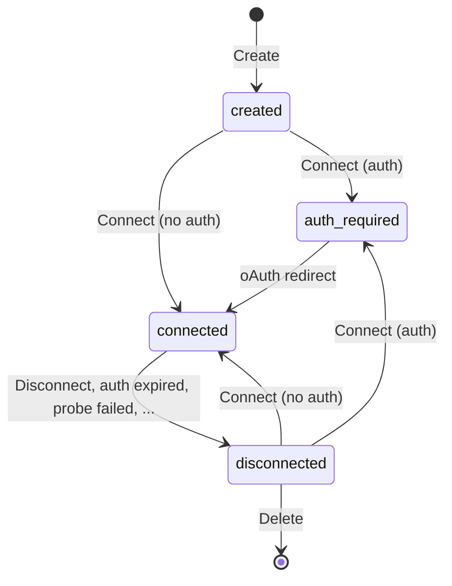

Connectors are remote MCP servers registered into the Agent Stack. Effectively, they take some responsibilities away from MCP Clients to improve user experience and reduce overhead within the Agent Stack.

Once connector is created and connected, it can be used as any regular remote MCP server by both clients and agents.

## API Reference

Core of connectors API consists of the following endpoints:

| Endpoint                                  | Purpose                |
| ----------------------------------------- | ---------------------- |
| `POST /api/v1/connectors`                 | Create a connector     |
| `GET /api/v1/connectors`                  | List all connectors    |
| `GET /api/v1/connectors/{id}`             | Read a connector       |
| `DELETE /api/v1/connectors/{id}`          | Delete a connector     |
| `POST /api/v1/connectors/{id}/connect`    | Connect a connector    |
| `POST /api/v1/connectors/{id}/disconnect` | Disconnect a connector |

The connector can then be used by any MCP client at `/api/v1/connectors/{id}/mcp` endpoint. For example, to inspect a connector using MCP Inspector:

```bash
npx -y @modelcontextprotocol/inspector --transport http --server-url http://localhost:8333/api/v1/connectors/{id}/mcp
```

Additionally, the connectors API exposes a catalog of preconfigured presets for common connectors:

| Endpoint                         | Purpose                |
| -------------------------------- | ---------------------- |
| `GET /api/v1/connectors/presets` | List connector presets |

## Lifecycle

Following diagram illustrates the lifecycle of a connector:



Usual flow works as follows:

1. **Create**: Client creates a connector by calling `POST /api/v1/connectors` with MCP server URL.
2. **Connect**: Client initiates connection by calling `POST /api/v1/connectors/{id}/connect`.
   - For OAuth-enabled servers: The response will contain an authorization URL for the user to complete authentication
   - For token-based authentication: Provide an `access_token` in the connect request body (see [Authentication](#authentication))
3. **Authorize** (OAuth only): User visits the authorization URL, authenticates and grants access. Authorization server redirects the user back to the platform with an authorization code.
4. **Complete**: Platform exchanges the authorization code for access and refresh tokens (OAuth) or stores the provided access token. Once completed, the connector is in `connected` state and ready to be used.

## Authentication

Connectors support two authentication methods:

### OAuth (External MCP Servers)

For MCP servers that support OAuth, the platform handles the full authorization code flow. No additional configuration is needed in the connect request.

### Token-based Authentication

For MCP servers that use simple token-based authentication, provide the token when connecting:

```json
POST /api/v1/connectors/{id}/connect
{
  "access_token": "YOUR_API_TOKEN"
}
```

The authentication token is used differently depending on the connector type:
- **External HTTP/HTTPS MCP servers**: Token is sent as a Bearer token in the `Authorization` header for all requests
- **Managed stdio MCP servers**: Token is injected as an environment variable in the container (requires `access_token_env_name` in preset configuration)

## Error handling

The connectors API endpoints return standard HTTP status codes in responses. Apart from that, there are two additional mechanisms used by connectors API to relay errors to the client.

### Authorization Code Flow

An error may happen during the authorization code flow as described in [RFC6749 Section 4.1](https://www.rfc-editor.org/rfc/rfc6749#section-4.1.2.1).

When no `redirect_url` has been provided by the client during connection initiation, the server responds with a HTML page containing the error. Otherwise, the user will be redirected to `redirect_url` instead. The `error` and `error_description` query parameters will be included in the redirect.

### Disconnection

Connector can be asynchronously disconnected at any time. This can happen for various reasons including intentional disconnect, refresh token expiration or an arbitrary error. The client MAY check for the `disconnected` state and read `disconnect_reason` to read the description of what happened.

## Connector Presets

Connector presets provide pre-configured settings for common MCP servers, simplifying the connector creation process. Presets can include:

- **URL**: The MCP server endpoint (supports `http://`, `https://`, and `mcp+stdio://` schemes)
- **Client credentials**: Pre-configured OAuth `client_id` and `client_secret` for public clients
- **Metadata**: Display information such as name and description
- **Stdio configuration**: For `mcp+stdio://` URLs, container image and runtime settings for managed MCP servers

### Available Presets

The platform comes with several built-in presets:

| MCP Server | URL                                 | Description                                                             |
| ---------- | ----------------------------------- | ----------------------------------------------------------------------- |
| Stripe     | `https://mcp.stripe.com`            | Payment processing and financial infrastructure tools                   |
| Box        | `https://mcp.box.com`               | Search, access and get insights on your Box content                     |
| GitHub     | `https://api.githubcopilot.com/mcp` | Access and interact with your GitHub repositories and code intelligence |

### Using Presets

When creating a connector with `POST /connectors`, the system automatically matches the provided URL against available presets (this behavior is controlled by the `match_preset` parameter, which defaults to `true`). If a match is found:

1. **Client credentials**: If no `client_id` is provided in the request, the preset's credentials are used automatically
2. **Metadata**: If no metadata is provided in the request, the preset's metadata (name, description) is used

This allows for simplified connector creation. For example, to create a GitHub connector:

```json
POST /connectors
{
  "url": "https://api.githubcopilot.com/mcp"
}
```

The system will automatically apply the preset's client credentials and metadata.

To disable preset matching and provide all credentials manually, set `match_preset: false` in the request.

### Configuring Presets

Connector presets are configurable via Helm values when deploying Agent Stack. The presets are defined in the `connector.presets` section of `values.yaml`:

#### Remote MCP Servers (HTTP/HTTPS)

For MCP servers accessible over HTTP/HTTPS with Streamable HTTP transport:

```yaml
connector:
  presets:
    - url: "https://mcp.stripe.com"
      metadata:
        name: "Stripe"
        description: "Payment processing and financial infrastructure tools"
    - url: "https://mcp.box.com"
      client_id: "YOUR_CLIENT_ID"
      client_secret: "YOUR_CLIENT_SECRET"
      metadata:
        name: "Box"
        description: "Search, access and get insights on your Box content"
```

#### Managed MCP Servers (stdio)

For MCP servers that use stdio transport, Agent Stack can manage them as Kubernetes deployments using the `mcp+stdio://` scheme. The platform automatically:

- Deploys the MCP server as a Kubernetes pod with a sidecar container running [supergateway](https://github.com/supercorp-ai/supergateway)
- Exposes the stdio MCP server over Streamable HTTP transport via supergateway
- Manages the deployment lifecycle (creates on connect, deletes on disconnect)
- Handles authentication tokens via environment variables

```yaml
connector:
  presets:
    - url: "mcp+stdio://example-mcp"
      metadata:
        name: "Example MCP"
        description: "Example stdio-based MCP server"
      stdio:
        image: "registry.example.com/mcp-server:latest"
        command: ["node"]  # Optional: override container command
        args: ["dist/index.js"]  # Optional: override container args
        env:  # Optional: additional environment variables
          LOG_LEVEL: "info"
        access_token_env_name: "API_TOKEN"  # Optional: env var name to inject access token
```

The managed MCP architecture uses a sidecar pattern:
- **MCP Server Container**: Runs your stdio-based MCP server
- **Supergateway Sidecar**: Wraps the stdio interface and exposes it as Streamable HTTP at port 8080

When a connector using a managed preset is connected, the platform:
1. Creates a Kubernetes Deployment with both containers
2. Creates a Kubernetes Service to expose the supergateway
3. Waits for the deployment to become ready (up to 60 seconds)
4. Proxies MCP requests to the managed service
5. If an `accessToken` was provided in the connect request and the preset defines `access_token_env_name`, injects the token as an environment variable

When disconnected, the platform cleans up the Deployment and Service resources.

#### Configuration Details

The presets are injected into the platform via the `CONNECTOR__PRESETS` environment variable, which is populated from a Kubernetes Secret created by Helm. This allows administrators to:

- Add custom MCP server presets for their organization (both remote and managed)
- Modify or remove default presets
- Configure client credentials for remote MCP servers with OAuth
- Configure stdio container images and settings for managed MCP servers
- Customize metadata (names, descriptions) for better user experience

After modifying preset configuration in Helm values, redeploy the platform for changes to take effect.

## Python SDK

The AgentStack Python SDK provides a convenient wrapper around the connectors API, handling common patterns and reducing boilerplate. While it maps directly to API endpoints, the SDK adds extra functionality for smoother interaction patterns such as methods to wait until a connector reaches a desired state or until it is deleted.

### Getting Started
```python
from agentstack_sdk.platform.connector import Connector, ConnectorState
```

### Core Operations

#### Create a Connector
```python
connector = await Connector.create(
    url="https://api.githubcopilot.com/mcp",
    client_id="optional_id",
    client_secret="optional_secret",
    metadata={"custom": "data"},
    match_preset=True
)
```

#### Delete a Connector
```python
await connector.delete()
await connecrtor.wait_for_deletion(). # Wait until the connector is deleted from the platform
```

#### List Connectors
```python
result = await Connector.list()
for connector in result.items:
    print(f"{connector.id}: {connector.url} ({connector.state})")
```

#### Get or Refresh a Connector
```python
# Get a specific connector
connector = await Connector.get(connector_id)

# Refresh an existing connector instance
connector = await connector.refresh()
```

#### List Presets
```python
presets = await Connector.presets()
for preset in presets.items:
    print(preset)
```

### Authentication & Connection

#### OAuth Authentication

For OAuth-enabled servers, the SDK automatically opens the browser when `connect()` is called. Use `wait_for_state()` to poll until authorization completes.
```python
# Connect with OAuth (browser will open automatically)
connector = await connector.connect(
    redirect_url="https://localhost:8080/callback"  # Optional
)

# Wait for authorization to complete
connector = await connector.wait_for_state(
    state=ConnectorState.connected,
    poll_interval=1  # Optional, seconds between polls
)
```

#### Token-Based Authentication

For services that use access tokens instead of OAuth:
```python
connector = await Connector.create(url="https://api.example.com/mcp")
connector = await connector.connect(access_token="your_api_token")
connector = await connector.wait_for_state(state=ConnectorState.connected)
```

#### Disconnect
```python
await connector.disconnect()
connector = await connector.wait_for_state(state=ConnectorState.disconnected)
```

### Advanced Features

#### Stream MCP Proxy Requests
```python
response_chunks = []
async for response in connector.mcp_proxy(
    method="POST",
    headers={"Accept": "application/json, text/event-stream"},
    content=json.dumps(mcp_request).encode()
):
    response_chunks.append(response.chunk)

response_text = b"".join(response_chunks).decode()
```


### Complete Workflow Example
```python
import asyncio
from agentstack_sdk.platform.connector import Connector, ConnectorState

async def main():
    # Create connector
    connector = await Connector.create(url="https://mcp.stripe.com")
    
    # Connect (browser opens for OAuth if needed)
    connector = await connector.connect()
    connector = await connector.wait_for_state(state=ConnectorState.connected)
    
    # Use the connector
    for k, v in connector.model_dump().items():
        print(f"{k}: {v}")
    
    # Cleanup
    await connector.disconnect()
    await connector.delete()
    await connector.wait_for_deletion()

asyncio.run(main())
```

Check out the repository for more examples.