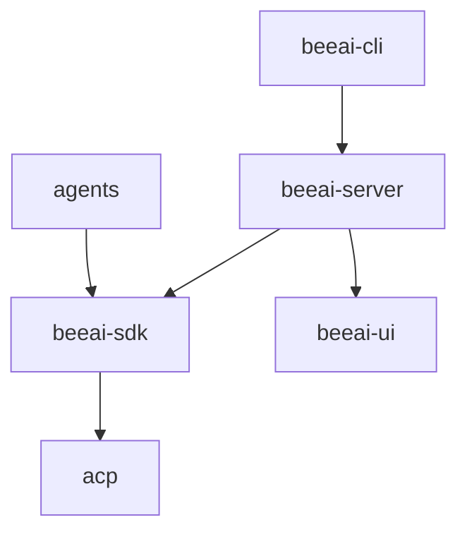

## Contributing an agent

To contribute an agent to BeeAI, please use [BeeAI Provider Template](https://github.com/i-am-bee/beeai-agent-starter-py) as a reference. This repository provides a structured template for building and integrating new agents.

## Development setup

---

### Installation

BeeAI uses [Mise-en-place](https://mise.jdx.dev/) to manage tool versions (`python`, `uv`, `nodejs`, `pnpm` etc.), as well as for task running and environment management. Mise automatically downloads and installs the necessary tools — no manual installation required.

Clone this project, then run these setup steps:

```sh
brew install mise # more ways to install: https://mise.jdx.dev/installing-mise.html
mise trust
mise install
```

After setup, use:

- `mise run` to list and select tasks interactively
- `mise <task-name>` to run a specific task
- `mise x -- <command>` to run a project tool (e.g., `mise x -- uv add <package>`)

To run tools directly without `mise x --`, activate a shell hook:

- **Bash**: `eval "$(mise activate bash)"` (add to `~/.bashrc` for performance)
- **Zsh**: `eval "$(mise activate zsh)"` (add to `~/.zshrc` for performance)
- **Fish**: `mise activate fish | source` (add to `~/.config/fish/config.fish` for performance)
- **Other shells**: [Refer to documentation](https://mise.jdx.dev/installing-mise.html#shells)

---

### Configuration

Edit `[env]` in `mise.local.toml` in the project root ([documentation](https://mise.jdx.dev/environments/)). If the file is missing, run `mise setup`.

---

### Running BeeAI

To run BeeAI components in development mode:

1. **Server**

```sh
# Remove existing providers to prevent conflicts during development
rm -f ~/.beeai/providers.yaml

# Start the API server (keep running in a terminal window)
mise beeai-server:run
```

2. **CLI**

```sh
# Add official framework provider 
mise beeai-cli:run -- provider add file://agents/official/beeai-framework/beeai-provider.yaml

# List available tools
mise beeai-cli:run -- tool list

# Call a tool
mise beeai-cli:run -- tool call fetch '{"url": "http://iambee.ai"}'

# List and run agents
mise beeai-cli:run -- agent list
mise beeai-cli:run -- agent run website_summarizer "summarize iambee.ai"
```

3. **UI**

```sh
# Start the UI development server
mise beeai-ui:run

# UI is also available via beeai-server in static mode
mise beeai-server:run
```

---

## Releasing

BeeAI consists of multiple projects released to NPM, PyPI, and Homebrew via GitHub Actions.

<Warning>
    Dependencies use strict versioning — most releases require updating dependents as well
</Warning>



### Releasing `acp-typescript-sdk` and `acp-python-sdk`

Update both:
- `packages/acp-typescript-sdk/package.json`
- `packages/acp-python-sdk/pyproject.toml` 

Commit the changes, push to `main`, and create a tag:
```sh
git tag acp-v<version>
git push origin acp-v<version>
```
Monitor GitHub Actions for success.

### Releasing `beeai-sdk`

Update both:
- `packages/beeai-sdk/package.json`
- `packages/beeai-sdk/pyproject.toml`

Commit the changes, push to `main`, and tag the release:
```sh
git tag beeai-sdk-v<version>
git push origin beeai-sdk-v<version>
```
Check GitHub Actions for status.

### Releasing agents

BeeAI loads agents from `provider-registry.yaml`.

To release an agent:

1. Update `beeai-provider.yaml` in the agent’s repository.

2. Tag the commit:
```sh
git tag agents-v<version>
git push origin agents-v<version>
```

3. Update the corresponding URL in `provider-registry.yaml`.

4. Push the changes and confirm with:
```sh
mise beeai-cli:run -- provider list
```

<Tip>
Be sure to bumpt the version in the URL in **both** `beeai-provider.yaml` of the affected agents and the corresponding URLs in `provider-registry.yaml`.
To not accidentally bump the version in `provider-registry.yaml` before creating the tag, first update `beeai-provider.yaml` file(s), tag that commit, and update `provider-registry.yaml` in a later commit. Or use `git push --atomic main agents-v...`.
Wait a while, or restart your local BeeAI service, and confirm using `beeai provider list` that the new versions have been loaded.
</Tip>

### Releasing `beeai-ui`

`beeai-ui` is bundled in `beeai-server` and does not have independent versioning. Changes require releasing `beeai-server`.

### Releasing `beeai-server`

<Warning>
    Ensure dependencies are released first
</Warning>

Update the version in `apps/beeai-server/pyproject.toml`, commit changes, and tag the release:
```sh
git tag beeai-server-v<version>
git push origin beeai-server-v<version>
```

<Tip>
    After releasing `beeai-server`, bump the dependency version and release `beeai-cli` as well.
</Tip>

### Releasing `beeai-cli`

<Warning>
    Ensure dependencies are released first
</Warning>

Update the version in `apps/beeai-cli/pyproject.toml`, commit, and tag: 
```sh
git tag beeai-cli-v<version>
git push origin beeai-cli-v<version>
```

After PyPI release, update Homebrew:
```sh
brew tap i-am-bee/beeai
brew bump-formula-pr i-am-bee/beeai/beeai --version <version>
```

A PR will be created. **Do not merge manually.** Instead, tag the PR with `pr-pull`, and the GitHub Action will merge it automatically.
 
<Note>
    This might take up to one hour.
</Note>