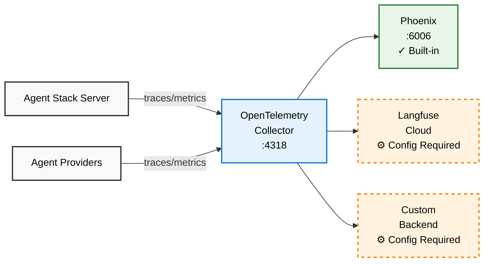

Agent Stack provides built-in observability through [OpenTelemetry (OTLP)](https://opentelemetry.io/). This allows you to monitor agent health, performance metrics, and execution traces in real-time. By default, the stack integrates with [Arize Phoenix](https://docs.arize.com/phoenix) for local visualization, but it can be routed to any OTLP-compliant backend.




For telemetry to flow successfully, it must be enabled at three levels:
<Steps>
   <Step title="The Agent Logic">
  You must instrument your agent logic to capture LLM calls and tool usage.
   </Step>

   <Step title="The Python SDK">
  The server must be configured to export that data by setting `configure_telemetry=True`.
   </Step>

   <Step title="The Agent Stack Platform">
  The infrastructure must be running a collector and a backend (like Arize Phoenix) to receive and display the data.
   </Step>

</Steps>

## Agent SDK Configuration
Before configuring an observability platform, your agent code must be "telemetry-aware." This configuration applies to all implementations, whether you are using local Phoenix or a cloud provider like Langfuse.

You must initialize instrumentation at the agent logic level and enable the export flag in the Agent Stack SDK:

```python
from agentstack_sdk.server import Server
# 1. Agent Level: Import your specific instrumentor
# from openinference.instrumentation.beeai import BeeAIInstrumentor

# Initialize the instrumentor to capture framework events
# BeeAIInstrumentor().instrument()

server = Server()

@server.agent()
async def my_agent(): 
    ...

# 2. SDK Level: Enable the bridge to the platform collector
server.run(configure_telemetry=True)
```

<Tip>
  For an enhanced user experience and richer trace detail, consider instrumenting agents using the [OpenInference](https://github.com/Arize-ai/openinference/) standard for custom instrumentation.
</Tip>

## Simple Monitoring: Agent Logs

The quickest way to see what your agent is doing is by streaming its logs directly to your terminal. This is ideal for debugging container lifecycle events and immediate request errors.

```bash
agentstack logs
```

What you'll see:
- Agent startup and initialization
- Request processing steps
- Error messages and stack traces
- Container lifecycle events

<Note>
  Logs are only available for managed (containerized) agents that are currently running on Agent Stack.
</Note>

## Advanced Observability: Traces & Metrics

By default, Agent Stack integrates with [Arize Phoenix](https://phoenix.arize.com/) for local visualization of agent traces. For cloud-based observability and production monitoring, you can easily integrate [Langfuse](https://langfuse.com/).

Telemetry details include:
- Platform version and runtime details
- Agent execution traces

### Enable Phoenix Observability

<Warning>
  **License Notice**: Phoenix is [licensed under the Elastic License v2 (ELv2)](https://github.com/Arize-ai/phoenix/blob/main/LICENSE). It is disabled by default in Agent Stack. By enabling it, you acknowledge responsibility for ensuring compliance with these terms in your specific use case.
  </Warning>

<Steps>
   <Step title="Install and Enable">

Install and start Phoenix using the `agentstack platform start` command:
```sh
agentstack platform start --set phoenix.enabled=true
```

You can run this even if your platform is already running; it will update the configuration without losing existing data.

  </Step>
  
  <Step title="Verify Initialization">
Spinning up the Phoenix container can take a moment, even after the CLI reports success. Go to [http://localhost:6006](http://localhost:6006) and check if it's running. If not, please wait a few moments.

   </Step>
   
   <Step title="Run and View">

Execute an agent to generate data:
```sh
agentstack run chat "Hello"
```

   </Step>
   <Step title="View Traces in Phoenix">

Open [http://localhost:6006](http://localhost:6006) in your browser and navigate to the **default** project to explore the collected traces.

   </Step>
</Steps>


### Enable Langfuse Observability
To route traces to Langfuse, provide a custom OTLP configuration:

<Steps>

<Step title="Get Langfuse credentials">
1. Sign up at [cloud.langfuse.com](https://cloud.langfuse.com)
2. Create a project and generate API keys
3. Encode your keys: `echo -n "public_key:secret_key" | base64`
</Step>

<Step title="Create a configuration file (config.yaml):">
```yaml
collector:
  exporters:
    otlphttp/langfuse:
      endpoint: "https://cloud.langfuse.com/api/public/otel" # EU data region
      headers:
        Authorization: "Basic <auth-string>"
  pipelines:
    traces:
      receivers: [ otlp ]
      processors: [ memory_limiter, filter/phoenix, batch ]
      exporters: [ otlphttp/langfuse ]
```
</Step>

<Step title="Start the platform with the configuration">
```bash
agentstack platform start -f config.yaml
```
</Step>

<Step title="Run and View">

Execute an agent to generate data:
```sh
agentstack run chat "Hello"
```
Check your Langfuse project dashboard for incoming traces and metrics.
</Step>

</Steps>

## Additional Resources

- **OpenTelemetry Docs**: https://opentelemetry.io/docs/
- **Langfuse Docs**: https://langfuse.com/docs
- **Phoenix Docs**: https://docs.arize.com/phoenix
- **Prometheus Docs**: https://prometheus.io/docs/
- **Grafana Docs**: https://grafana.com/docs/
