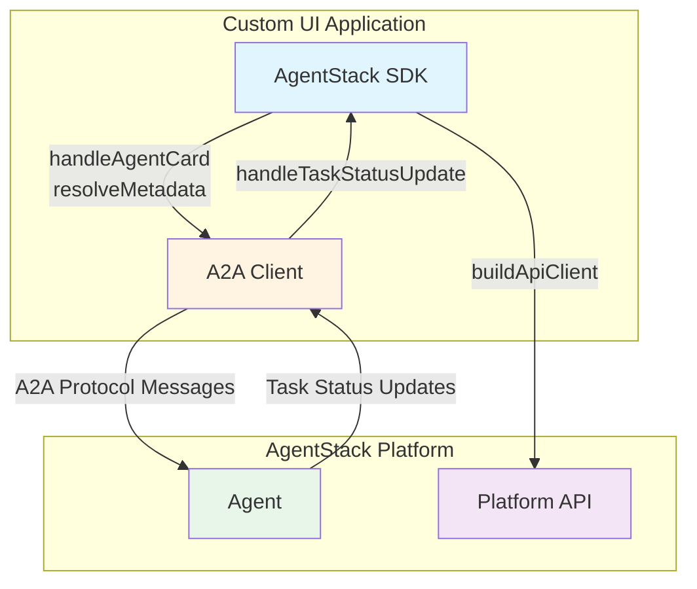

The AgentStack TypeScript SDK is a layer built on top of the [Agent-to-Agent (A2A) Protocol](https://a2a-protocol.org/). While you can use plain [A2A SDK](https://github.com/a2aproject/a2a-js), AgentStack forms an opinion on basic agentic principles that are exposed in the AgentStack UI. This is achieved by **leveraging the A2A extension system and extending the protocol** to allow agents to declare their needs at runtime.

The SDK helps you work with this extension system by providing **typing and parsing** for extensions. Instead of manually parsing extension URIs and metadata, the SDK gives you type-safe functions to extract data from agent cards.

## Architecture Overview

The SDK consists of two main components:

1. **A2A Extensions Handling** - Processes agent capabilities and manages the extension system through `handleAgentCard` and related functions
2. **Platform API Client** - Provides HTTP client wrapper for interacting with the AgentStack platform API via `buildApiClient`



## Core Concepts

### Agent Cards and Capabilities

Agents declare their capabilities through **agent cards**. These cards specify what extensions the agent supports, such as:

- **Service extensions** (LLM, embeddings, MCP, OAuth, secrets): Agent asks for a demand and it is client's responsibility to fulfill the demand. Think of a Dependency Injection where the client is injecting the dependency.
- **UI extensions** (forms, citations, trajectory visualization): Extends basic A2A messaging with a structure that simplifies working with GUIs.

The SDK processes these capabilities to determine what the agent needs from your application. When you receive an agent card, you use `handleAgentCard` to extract the demands and get a `resolveMetadata` function.

### Task Status Updates

During task execution, agents send **task status updates** through the A2A protocol. These updates can indicate:

- **Message updates** - New content from the agent
- **Input required** - Agent needs user input (forms, canvas edits)
- **Auth required** - Agent needs authentication (OAuth, secrets)

The SDK provides `handleTaskStatusUpdate` to parse A2A `TaskStatusUpdate` and extract structured information:

```typescript
const results = handleTaskStatusUpdate(event);

for (const result of results) {
  switch (result.type) {
    case TaskStatusUpdateType.FormRequired:
      // Display form to user
      break;
    case TaskStatusUpdateType.OAuthRequired:
      // Redirect to OAuth URL
      break;
    case TaskStatusUpdateType.SecretRequired:
      // Prompt for secret
      break;
  }
}
```

### Agent Stack API Client

The `buildApiClient` function creates an HTTP client that exposes all AgentStack server capabilities. This client enables you to:

- **Manipulate files** - Upload, download, and manage files in agent contexts
- **Manage vector stores** - Create and manage vector stores for RAG and semantic search
- **Provide fulfillments for extensions** - Access platform services like LLM providers, embeddings, and connectors that you can use to fulfill service extension demands
- **Manage contexts and permissions** - Create contexts and generate context tokens with appropriate permissions for agent access

The API client is typically used alongside extension fulfillments. For example, you might use it to get a context token that grants LLM access, then use that token in your LLM fulfillment function to provide the agent with model access.


## Next Steps

Now that you understand the basic concepts:
- **[Extensions](/development/custom-ui/client-sdk/extensions)** - Deep dive into service and UI extensions
- **[API Client](/development/custom-ui/client-sdk/api-client)** - Complete reference for the AgentStack platform API client
- **[Examples](/development/custom-ui/client-sdk/examples)** - Complete working examples and integration patterns
