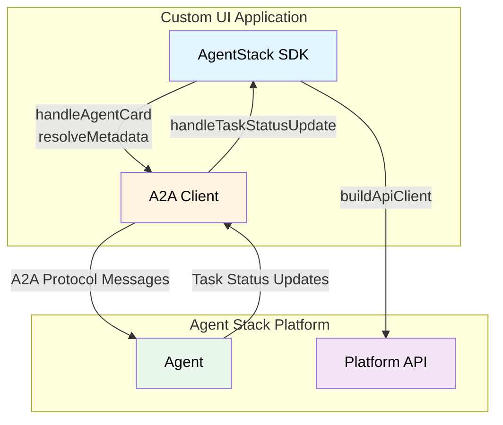

The Agent Stack TypeScript Client SDK simplifies building custom UIs for A2A agents. It handles agent service demands, maps task status updates to UI actions, and provides a typed platform API client. Use it to fulfill agent requirements, render interactive elements like forms and approvals, and manage communication between your UI and Agent Stack.

It builds on the [Agent2Agent Protocol (A2A)](https://a2a-protocol.org/) and provides two layers:

1. A2A extensions and helpers that translate agent card demands such as LLM access, embeddings, OAuth, and secrets into client fulfillments like API keys, model choices, redirect URIs, and secret values, plus UI metadata.
2. A platform API client that talks to the AgentStack server.

The SDK also exports A2A protocol types and Zod schemas so your UI can stay in sync with the protocol.

## Quick Start

### 1. Install

```bash
npm i agentstack-sdk @a2a-js/sdk
```

### 2. Create the platform API client

```typescript
import { buildApiClient, createAuthenticatedFetch } from "agentstack-sdk";

const baseUrl = "https://your-agentstack-instance.com";

const api = buildApiClient({
  baseUrl,
  fetch: createAuthenticatedFetch(accessToken),
});
```

`buildApiClient` exposes the platform API with typed responses and runtime validation.
Use the user access token from your identity provider (OIDC/OAuth) for UI side API calls.

### 3. Create context and context token

```typescript
const providers = unwrapResult(await api.listProviders());
const providerId = providers[0]?.id;

const context = unwrapResult(
  await api.createContext({ provider_id: providerId }),
);

const contextToken = unwrapResult(
  await api.createContextToken({
    context_id: context.id,
    grant_global_permissions: {
      llm: ["*"],
      embeddings: ["*"],
      a2a_proxy: ["*"],
    },
    grant_context_permissions: {
      files: ["*"],
      vector_stores: ["*"],
      context_data: ["*"],
    },
  }),
);
```

<Tip>
  **Finding `providerId`** Use `listProviders` or `readProviderByLocation` from the platform API to identify the agent you want. See **[Platform API Client](./platform-api-client)** for the provider endpoints.
</Tip>

Context tokens are scoped for agent use and can also authenticate to the platform API when running inside the agent. See **[Permissions and Tokens](./permissions-and-tokens)** for token types and scopes.

<Tip>
  **Token usage summary**

  - Use **access token** for platform API calls from the UI.
  - Use **context token** for A2A client calls and agent card fetches.
</Tip>

All API calls return `ApiResult<T>`. Use `unwrapResult` if you want exceptions, and then handle errors with `isHttpError`, `isNetworkError`, `isParseError`, and `isValidationError`.

### 4. Create an A2A client and send a message

Pass the **context token** to the A2A client fetch. Then fetch the agent card, resolve demands, and stream a message.
For a full walkthrough (status updates, user responses, and cancellation), see **[A2A Client Integration](./a2a-client)**.

```typescript
import {
  ClientFactory,
  ClientFactoryOptions,
  DefaultAgentCardResolver,
  JsonRpcTransportFactory,
} from "@a2a-js/sdk/client";
import { createAuthenticatedFetch, getAgentCardPath } from "agentstack-sdk";

const fetchImpl = createAuthenticatedFetch(contextToken.token);

const factory = new ClientFactory(
  ClientFactoryOptions.createFrom(ClientFactoryOptions.default, {
    transports: [new JsonRpcTransportFactory({ fetchImpl })],
    cardResolver: new DefaultAgentCardResolver({ fetchImpl }),
  }),
);

const agentCardPath = getAgentCardPath(providerId);
const client = await factory.createFromUrl(baseUrl, agentCardPath);

const stream = client.sendMessageStream({
  message: {
    kind: "message",
    role: "user",
    messageId: crypto.randomUUID(),
    contextId: context.id,
    parts: [{ kind: "text", text: "Hello" }],
  },
});
```

`createAuthenticatedFetch` attaches the `Authorization` header to every request so the A2A client can load the agent card and open JSON RPC streams with authentication.

The agent card URL follows this convention:

`{baseUrl}/api/v1/a2a/{providerId}/.well-known/agent-card.json`

- `baseUrl` is your Agent Stack server root
- `providerId` is the agent provider identifier

`getAgentCardPath(providerId)` returns the **path portion** of that URL. Use it with `ClientFactory.createFromUrl(baseUrl, agentCardPath)` so the client can resolve the full
agent card endpoint.

<Tip>
  **Need UI events and follow up messages?** The **[A2A Client Integration](./a2a-client)** shows how to handle status updates, render forms and approvals, and respond with user metadata.
</Tip>

## Architecture overview



## SDK entrypoints

The SDK is split into focused entrypoints:

1. `agentstack-sdk` for everything
2. `agentstack-sdk/api` for platform API client, schemas, and types
3. `agentstack-sdk/core` for extension helpers and A2A interaction utilities
4. `agentstack-sdk/extensions` for A2A extension definitions and types

## Protocol Types and Schemas

The SDK exports A2A protocol types and Zod schemas that match the AgentStack UI usage, including:

- `Message`, `Part`, and `Task` types
- `TaskStatusUpdateEvent` and `TaskArtifactUpdateEvent`
- UI and service extension schemas

These exports are useful when building strongly typed UI layers or validating inbound messages.

## Next Steps

- **[A2A Client Integration](./a2a-client)** for the full streaming, UI events, and response flow
- **[Agent Requirements](./agent-requirements)** for service and UI extension handling
- **[Agent Responses](./agent-responses)** for rendering message parts and citations
- **[User Messages](./user-messages)** for composing user messages with metadata
- **[Error Handling](./error-handling)** for platform and extension error patterns
- **[Platform API Client](./platform-api-client)** for endpoint reference and error helpers
